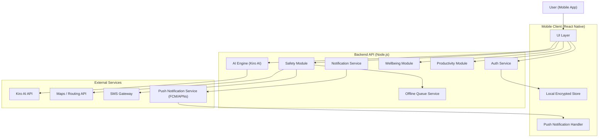

# Design Document

## Overview

NYRA is a mobile-first AI-powered safety and wellbeing companion for women. The application combines real-time emergency response, AI-driven conversation, emotional wellness tracking, and productivity tooling into a single cohesive experience.

The system is built around three core modules — Safety, Wellbeing, and Productivity — all orchestrated through an AI Engine that provides natural language interaction. A cross-cutting Auth/Privacy layer enforces security and data protection across all modules.

Key design goals:
- Sub-10-second SOS alert delivery with offline queuing
- Persistent AI conversation context across a session
- AES-256 encryption at rest for all personal data
- Graceful degradation when network or permissions are unavailable

---

## Architecture

NYRA follows a modular client-server architecture. The mobile client (React Native) hosts the UI and local state, while a backend API (Node.js/Express) handles business logic, AI orchestration, and data persistence.



### Key Architectural Decisions

- **Offline-first SOS queue**: SOS alerts are written to a durable local queue before network transmission. A background sync worker flushes the queue when connectivity is restored.
- **Session-scoped AI context**: Conversation history is held in server-side session memory (Redis) for the duration of a session, supporting at least 20 messages of context.
- **Module isolation**: Each module (Safety, Wellbeing, Productivity) exposes a well-defined API surface. The AI Engine calls module APIs to act on user intent rather than directly manipulating data.
- **Encryption at rest**: All sensitive fields are encrypted with AES-256 before writing to the database. Encryption keys are managed via a KMS (e.g., AWS KMS or equivalent).

---

## Components and Interfaces

### Auth Service

Handles registration, login, session management, and permission state.

```
POST /auth/register
POST /auth/login
POST /auth/logout
POST /auth/refresh
GET  /auth/permissions          → { location: bool, notifications: bool }
PUT  /auth/permissions          → update permission state
```

Session timeout: 10 minutes of inactivity triggers a lock event pushed to the client.

### AI Engine

Wraps the Kiro AI API. Maintains per-session conversation context in Redis.

```
POST /ai/message
  body: { sessionId, message }
  response: { reply, intent, suggestedActions[] }
```

`intent` is a classified label (e.g., `safety_concern`, `emotional_distress`, `task_creation`, `general`) used by the client to trigger module-specific flows.

`suggestedActions` is an ordered list of module actions the AI recommends (e.g., `{ module: "safety", action: "activate_sos" }`).

### Safety Module

```
POST /safety/sos/trigger         → start SOS event
POST /safety/sos/cancel          → cancel active SOS event
GET  /safety/sos/status          → current SOS state
POST /safety/contacts            → add emergency contact
PUT  /safety/contacts/:id        → edit emergency contact
DELETE /safety/contacts/:id      → remove emergency contact
GET  /safety/contacts            → list contacts
POST /safety/route               → request safe route
GET  /safety/checkin             → list scheduled check-ins
POST /safety/checkin             → schedule check-in
POST /safety/checkin/:id/confirm → confirm check-in
GET  /safety/tips                → list/search safety tips
PUT  /safety/tips/:id/bookmark   → bookmark a tip
```

### Wellbeing Module

```
POST /wellbeing/mood             → submit mood log entry
GET  /wellbeing/mood             → list mood history (query: range=7|30|90)
GET  /wellbeing/summary          → 30-day mood trend summary
```

### Productivity Module

```
POST /productivity/tasks         → create task
GET  /productivity/tasks         → list tasks (query: status, sort)
PUT  /productivity/tasks/:id     → update task
DELETE /productivity/tasks/:id   → delete task
POST /productivity/tasks/:id/complete → mark complete
```

### Notification Service

Internal service consumed by other modules. Delivers push notifications via FCM/APNs. Falls back to in-app banners when OS permissions are denied.

```
notify(userId, type, payload)
  type: sos_confirmation | checkin_reminder | task_due | daily_tip | contact_alert
```

During an active SOS event, the service suppresses all non-critical notification types.

---

## Data Models

### User

```typescript
interface User {
  id: string;                    // UUID
  email: string;                 // encrypted at rest
  passwordHash: string;
  createdAt: Date;
  lastActiveAt: Date;
  notificationPreferences: NotificationPreferences;
  locationPermissionGranted: boolean;
  notificationPermissionGranted: boolean;
}
```

### EmergencyContact

```typescript
interface EmergencyContact {
  id: string;
  userId: string;
  name: string;                  // encrypted at rest
  phone?: string;                // encrypted at rest
  email?: string;                // encrypted at rest
  confirmedAt?: Date;
  createdAt: Date;
}
```

Constraint: at least one of `phone` or `email` must be present. Max 5 per user (soft limit, configurable).

### SOSEvent

```typescript
interface SOSEvent {
  id: string;
  userId: string;
  triggeredAt: Date;
  cancelledAt?: Date;
  status: 'active' | 'cancelled' | 'resolved';
  initialLocation: GeoPoint;
  locationUpdates: LocationUpdate[];
  alertsSent: AlertRecord[];
}

interface LocationUpdate {
  timestamp: Date;
  location: GeoPoint;
}

interface AlertRecord {
  contactId: string;
  sentAt: Date;
  channel: 'sms' | 'email' | 'push';
  status: 'queued' | 'sent' | 'failed';
}
```

### CheckIn

```typescript
interface CheckIn {
  id: string;
  userId: string;
  scheduledAt: Date;
  confirmedAt?: Date;
  alertSentAt?: Date;
  lastKnownLocation?: GeoPoint;
  status: 'pending' | 'confirmed' | 'alerted';
  intervalMinutes: number;       // 5 to 1440 (24h)
}
```

### MoodLog

```typescript
interface MoodLog {
  id: string;
  userId: string;
  moodValue: 1 | 2 | 3 | 4 | 5;
  note?: string;                 // max 500 chars, encrypted at rest
  recordedAt: Date;
}
```

### Task

```typescript
interface Task {
  id: string;
  userId: string;
  title: string;
  dueDate?: Date;
  priority?: 'low' | 'medium' | 'high';
  status: 'active' | 'completed';
  completedAt?: Date;
  createdAt: Date;
  source: 'manual' | 'ai';
}
```

### SafetyTip

```typescript
interface SafetyTip {
  id: string;
  category: 'travel' | 'home' | 'digital' | 'general';
  title: string;
  body: string;
  tags: string[];
  region?: string;               // ISO 3166-1 alpha-2 or subdivision code
}
```

### NotificationPreferences

```typescript
interface NotificationPreferences {
  sosConfirmations: boolean;
  checkinReminders: boolean;
  taskDueDates: boolean;
  dailyTips: boolean;
  contactAlerts: boolean;
}
```

### GeoPoint

```typescript
interface GeoPoint {
  latitude: number;
  longitude: number;
  accuracy?: number;             // meters
}
```

### ConversationSession

```typescript
interface ConversationSession {
  sessionId: string;
  userId: string;
  messages: ConversationMessage[];  // last 20 retained in context
  startedAt: Date;
  lastMessageAt: Date;
}

interface ConversationMessage {
  role: 'user' | 'assistant';
  content: string;
  timestamp: Date;
  intent?: string;
}
```

---

## Correctness Properties

*A property is a characteristic or behavior that should hold true across all valid executions of a system — essentially, a formal statement about what the system should do. Properties serve as the bridge between human-readable specifications and machine-verifiable correctness guarantees.*

### Property 1: SOS alert delivery completeness and location inclusion

*For any* user with any set of configured emergency contacts, when an SOS event is triggered with a known GPS location, every contact in the user's contact list should appear in the event's `alertsSent` records, and each alert payload should contain the triggering GPS coordinates.

**Validates: Requirements 1.1, 1.2**

---

### Property 2: Offline SOS queuing round-trip

*For any* SOS trigger that occurs while the device has no network connectivity, the alert should be placed in the offline queue, and after connectivity is restored and the queue is flushed, all queued alerts should transition to `sent` status.

**Validates: Requirements 1.4**

---

### Property 3: SOS location tracking lifecycle

*For any* active SOS event, location updates appended during the event should all be associated with that event, and after the event is cancelled, no further location updates should be appended to it.

**Validates: Requirements 1.5, 1.6**

---

### Property 4: Emergency contact CRUD round-trip

*For any* valid emergency contact (with a name and at least one contact method), creating it, retrieving it, editing it, retrieving it again, and then deleting it should result in the contact no longer appearing in the contact list.

**Validates: Requirements 2.1**

---

### Property 5: Emergency contact validation

*For any* contact submission missing a name, or missing both phone and email, or containing a malformed phone number or email address, the system should reject the submission with a validation error and the contact list should remain unchanged.

**Validates: Requirements 2.2, 2.5**

---

### Property 6: Emergency contact capacity

*For any* user, adding up to 5 emergency contacts should always succeed; the system should accept each addition without error.

**Validates: Requirements 2.3**

---

### Property 7: Emergency contact confirmation notification

*For any* newly added emergency contact, the notification service should be called exactly once with a `contact_alert` payload addressed to that contact's phone or email.

**Validates: Requirements 2.4**

---

### Property 8: Safe route contains turn-by-turn steps

*For any* safe route returned by the routing service, the route object should contain a non-empty ordered list of navigation steps.

**Validates: Requirements 3.2**

---

### Property 9: Route deviation triggers recalculation

*For any* active route and any user position that falls outside the route corridor, the system should detect the deviation and produce a recalculated route from the current position to the destination.

**Validates: Requirements 3.3**

---

### Property 10: Night-time route preference flag

*For any* safe route request made between 20:00 and 06:00 local time, the request forwarded to the routing service should include a preference parameter indicating higher-lighting / higher-foot-traffic routes.

**Validates: Requirements 3.4**

---

### Property 11: Check-in scheduling creates notification job

*For any* scheduled check-in with a valid interval, the system should create a notification job whose trigger time matches the scheduled check-in time.

**Validates: Requirements 4.1**

---

### Property 12: Missed check-in alert includes last known location

*For any* check-in that is not confirmed within 5 minutes of its scheduled time, the system should send an alert to all configured emergency contacts, and each alert payload should include the user's last known location.

**Validates: Requirements 4.2, 4.5**

---

### Property 13: Check-in confirmation cancels pending alerts

*For any* pending check-in, confirming it should update its status to `confirmed`, record a timestamp, and cancel any pending emergency contact alert jobs for that check-in.

**Validates: Requirements 4.3**

---

### Property 14: Check-in interval validation

*For any* interval value in the range [5, 1440] minutes, the system should accept it; for any value outside that range, the system should reject it with a validation error.

**Validates: Requirements 4.4**

---

### Property 15: Safety concern intent triggers safety suggestions

*For any* AI message classified with `safety_concern` intent, the response's `suggestedActions` list should contain at least one action from the Safety Module.

**Validates: Requirements 5.2**

---

### Property 16: Emotional distress intent triggers wellbeing suggestions

*For any* AI message classified with `emotional_distress` intent, the response's `suggestedActions` list should contain at least one action from the Wellbeing Module.

**Validates: Requirements 5.3**

---

### Property 17: Conversation context retention

*For any* session with 20 or more consecutive messages, the session's stored message list should contain all 20 most recent messages with their correct roles and content.

**Validates: Requirements 5.4**

---

### Property 18: Mood log round-trip

*For any* mood value between 1 and 5 and any optional note of up to 500 characters, submitting a mood log entry should result in a stored record with the exact mood value, note, and a non-null timestamp.

**Validates: Requirements 6.1**

---

### Property 19: Mood history time-range filter

*For any* set of mood log entries and any valid range (7, 30, or 90 days), the returned history should contain only entries whose `recordedAt` timestamp falls within the selected range.

**Validates: Requirements 6.2**

---

### Property 20: Consecutive negative mood streak detection

*For any* sequence of mood log entries where 3 or more consecutive calendar days have a mood value of 1 or 2, the wellbeing module should flag the streak and include a wellbeing resource offer in the next response.

**Validates: Requirements 6.3**

---

### Property 21: Mood note length validation

*For any* note string of 500 characters or fewer, the mood log submission should succeed; for any note exceeding 500 characters, the submission should be rejected with a validation error.

**Validates: Requirements 6.4**

---

### Property 22: Safety tips category filter

*For any* category query, all returned safety tips should have a `category` field matching the queried category, and no tips from other categories should appear in the results.

**Validates: Requirements 7.1**

---

### Property 23: Location-specific safety tips

*For any* user location change to a new region, the system should return at least one safety tip whose `region` field matches the new region (when region-specific tips exist).

**Validates: Requirements 7.3**

---

### Property 24: Safety tip bookmark round-trip

*For any* safety tip, bookmarking it and then retrieving the user's bookmarks should include that tip in the results; removing the bookmark should exclude it.

**Validates: Requirements 7.4**

---

### Property 25: Task creation round-trip

*For any* task with a title and optional due date and priority, creating it should result in a stored record with those exact field values and a status of `active`.

**Validates: Requirements 8.1**

---

### Property 26: Task due date notification job

*For any* task with a due date, the system should create a notification job whose trigger time matches the task's due date.

**Validates: Requirements 8.2**

---

### Property 27: Completing a task removes it from active list

*For any* active task, marking it complete should change its status to `completed` and exclude it from queries filtered by `status=active`.

**Validates: Requirements 8.3**

---

### Property 28: Task filter and sort correctness

*For any* set of tasks and any filter/sort combination (status × sort field), the returned list should contain only tasks matching the filter status, and the list should be ordered correctly by the specified sort field.

**Validates: Requirements 8.4**

---

### Property 29: Unauthenticated requests are rejected

*For any* request to a protected API endpoint made without a valid session token, the system should return a 401 Unauthorized response and not return any personal data.

**Validates: Requirements 9.1**

---

### Property 30: Session inactivity timeout

*For any* session that has had no activity for 10 or more minutes, the session should be invalidated and subsequent requests using that session token should return 401.

**Validates: Requirements 9.2**

---

### Property 31: Location permission state reflects immediately

*For any* permission state change (grant or revoke), the system's reported permission state should immediately match the new value without requiring a restart.

**Validates: Requirements 9.6**

---

### Property 32: Notification preferences are respected

*For any* notification preference configuration, only notification categories that are enabled should result in notifications being dispatched; disabled categories should produce no notifications.

**Validates: Requirements 10.2, 10.3**

---

### Property 33: SOS event suppresses non-critical notifications

*For any* active SOS event, any attempt to dispatch a non-critical notification (task due, daily tip, check-in reminder) should be suppressed and not delivered to the user.

**Validates: Requirements 10.5**

---

## Error Handling

### Network Failures

- SOS alerts are written to a durable local queue before any network call. The queue is flushed by a background worker when connectivity is restored.
- AI Engine requests that fail due to network timeout return a user-facing error with a retry suggestion. The session context is preserved so the user can retry without losing history.
- Route requests that fail fall back to a standard navigation route with an informational message to the user.

### External Service Failures

- Kiro AI API errors (5xx, timeout): the AI Engine returns a structured error response `{ error: true, message: "...", retryable: true }`. The client displays the message and offers a retry button.
- SMS Gateway failures: alert records are marked `failed` and retried up to 3 times with exponential backoff. After 3 failures, the contact is marked as unreachable for this event and the user is notified in-app.
- Maps/Routing API failures: the Safety Module falls back to a standard route and informs the user that safety-aware routing is temporarily unavailable.

### Validation Errors

All validation errors follow a consistent response shape:

```json
{
  "error": "VALIDATION_ERROR",
  "field": "phone",
  "message": "Phone number must be in E.164 format (e.g. +15551234567)"
}
```

### Permission Denials

- Location permission denied: SOS events still trigger alerts but without GPS coordinates. The user is shown an in-app prompt explaining the limitation.
- Notification permission denied: the Notification Service falls back to in-app banners for time-sensitive alerts (SOS confirmation, check-in reminder).

### Session Expiry

When a session expires due to inactivity, the client receives a `401` with `{ reason: "SESSION_EXPIRED" }`. The client locks the UI and presents the re-authentication screen without clearing local data.

---

## Testing Strategy

### Dual Testing Approach

Both unit tests and property-based tests are required. They are complementary:

- **Unit tests** cover specific examples, integration points, and error conditions.
- **Property-based tests** verify universal properties across randomized inputs, catching edge cases that hand-written examples miss.

### Property-Based Testing

The property-based testing library for this project is **fast-check** (TypeScript/JavaScript).

Each property test must:
- Run a minimum of **100 iterations**
- Be tagged with a comment referencing the design property it validates
- Tag format: `// Feature: nyra-ai-companion, Property {N}: {property_text}`

Each correctness property defined in this document must be implemented by exactly one property-based test.

Example:

```typescript
// Feature: nyra-ai-companion, Property 5: Emergency contact validation
it('rejects contacts missing name or contact method', () => {
  fc.assert(
    fc.property(invalidContactArbitrary(), (contact) => {
      const result = validateContact(contact);
      expect(result.valid).toBe(false);
      expect(result.error).toBeDefined();
    }),
    { numRuns: 100 }
  );
});
```

### Unit Testing

Unit tests should focus on:
- Specific examples demonstrating correct behavior (e.g., a known SOS trigger flow end-to-end)
- Integration points between modules (e.g., AI Engine calling Productivity Module to create a task)
- Error conditions and fallback paths (e.g., AI service error returns correct error shape)
- Examples identified in prework (5.5, 5.6, 6.5, 7.2, 8.5, 9.4, 10.4)

Avoid writing unit tests that duplicate what property tests already cover.

### Test Organization

```
tests/
  unit/
    safety/
      sos.test.ts
      contacts.test.ts
      checkin.test.ts
      tips.test.ts
    wellbeing/
      mood.test.ts
    productivity/
      tasks.test.ts
    ai/
      engine.test.ts
    auth/
      session.test.ts
    notifications/
      service.test.ts
  property/
    safety.property.test.ts
    wellbeing.property.test.ts
    productivity.property.test.ts
    ai.property.test.ts
    auth.property.test.ts
    notifications.property.test.ts
```
